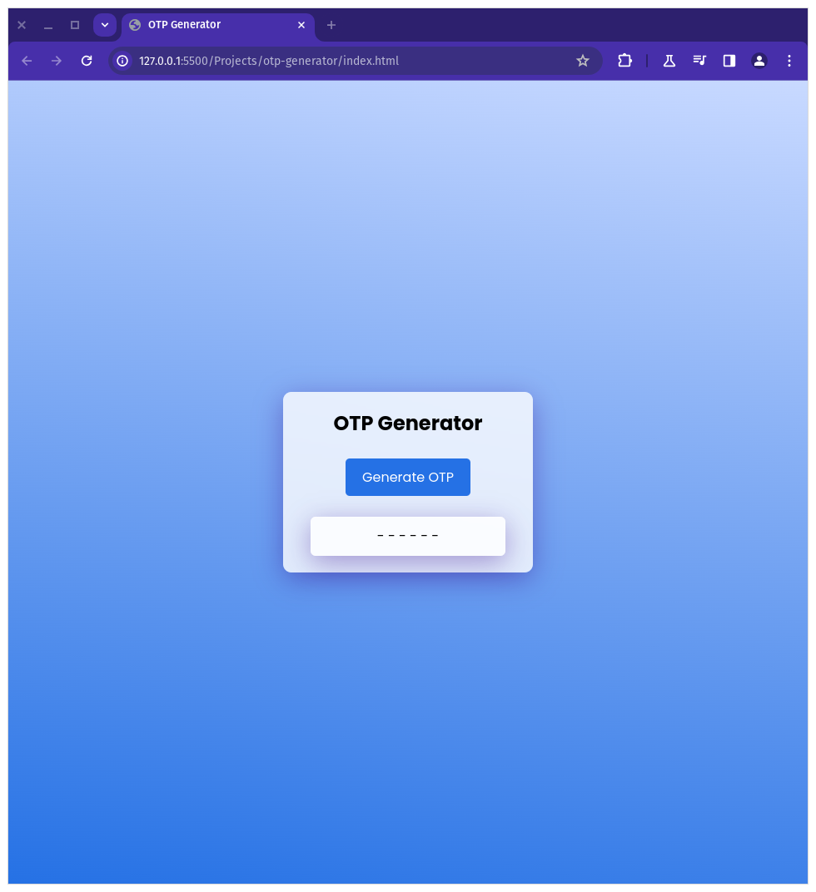
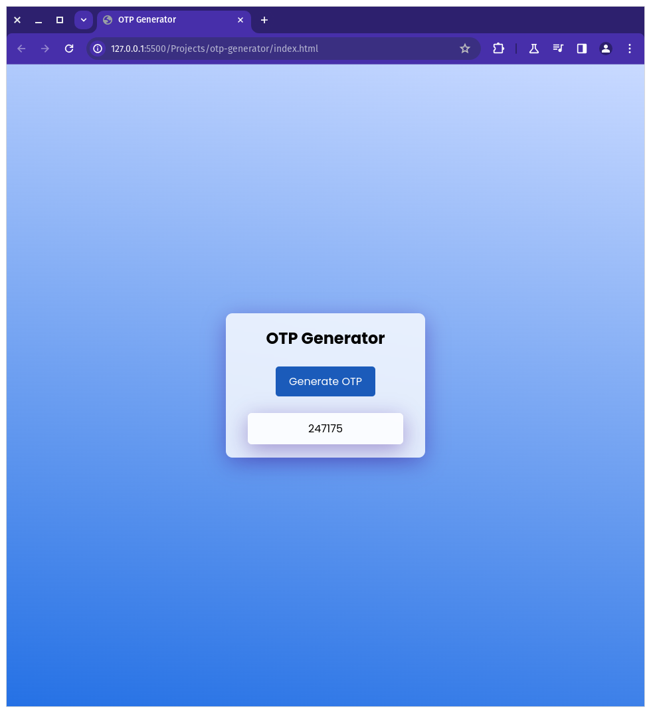

 <h1>OTP Generator</h1>
    

        This repository contains a simple OTP (One-Time Password) generator built using HTML, CSS, and JavaScript. The project allows users to generate a random 6-digit OTP by clicking a button.
    

<h2>Project Overview</h2>
    

        The OTP Generator provides a user interface with a button labeled "Generate OTP". When the user clicks this button, a 6-digit OTP is generated and displayed on the screen.
    

<h3>Features</h3>
    <ul>
        <li>Simple and intuitive user interface.</li>
        <li>Generates a 6-digit OTP.</li>
        <li>Displays the generated OTP in real-time.</li>
    </ul>

<h3>Usage</h3>
    
Clone the repository to your local machine:

    <pre><code>git clone https://github.com/Dark-Programer/secure-otp.git</code></pre>
    
Open the <code>index.html</code> file in your web browser to start generating OTPs.

<h3>Screenshots</h3>
    
    
    

<h3>Author</h3>
    
Arka Chakraborty

<h3>Code Explanation</h3>
    <h4>HTML Code</h4>
    
The HTML code defines the structure of the OTP generator interface.

    
It includes a <code>div</code> with the class <code>main</code> containing:

    <ul>
        <li>An <code>h2</code> element for the title "OTP Generator".</li>
        <li>A <code>button</code> with the class <code>btn</code> and id <code>generate</code> to trigger OTP generation.</li>
        <li>A <code>p</code> element with the id <code>generatedOtp</code> to display the generated OTP.</li>
    </ul>

<h4>JavaScript Code</h4>
    
The JavaScript code handles the functionality of the OTP generator.

    <ul>
        <li>It first selects the necessary DOM elements and stores them in variables (<code>otp</code> and <code>generatedOtp</code>).</li>
        <li>The <code>genOtp</code> function generates a random 6-digit OTP by generating a random number between 100000 and 999999.</li>
        <li>An event listener is added to the button. When the button is clicked, the <code>genOtp</code> function is called, and the generated OTP is displayed in the <code>generatedOtp</code> paragraph.</li>
    </ul>

<h3>Repo Link</h3>
    
<a href="https://github.com/Dark-Programer/secure-otp.git">https://github.com/Dark-Programer/secure-otp.git</a>

